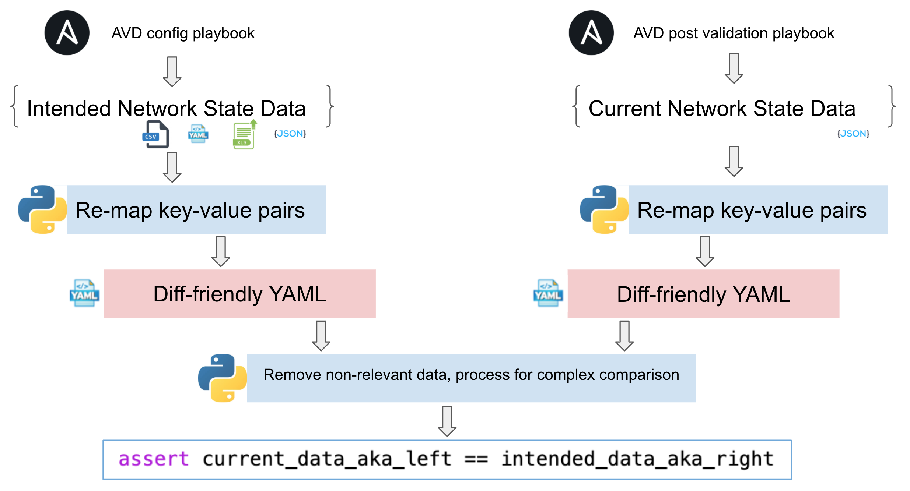

# NETDIFF POST VALIDATION

- [NETDIFF POST VALIDATION](#netdiff-post-validation)
  - [About](#about)
  - [Data Sources](#data-sources)
  - [Project Structure](#project-structure)
  - [Existing Test List](#existing-test-list)

## About

NetDiff is a simple framework for Arista network validation testing.
NetDiff expects following data sources:

- Actual (current) network state data collected from all switches.
- Intended network state provided by user or generated by automation tool.

NetDiff Python modules will re-format this data to build diff-friendly YAMLs.
These yamls will be processed to remove redundant data and support different comparison modes than just equality.

Afterwards data will be passed to the test framework (PyTes or Ward) for simple left vs. right assert.

This is represented on the picture below:


Every tests code only is exactly the same, only headers and filenames to compare are different.

PyTest example:

```python
@pytest.mark.parametrize("filename", ['topology.yml'])
def test_if_topology_is_correct(filename):
    current_data_aka_left, intended_data_aka_right = netdiff.process.test_data.for_yaml_diff(filename)
    assert current_data_aka_left == intended_data_aka_right
```

Ward test example:

```python
@test("Verify if topology is correct")
def test_if_topology_is_correct(filename='topology.yml'):
    current_data_aka_left, intended_data_aka_right = netdiff.process.test_data.for_yaml_diff(filename)
    assert current_data_aka_left == intended_data_aka_right
```

## Data Sources

Currently NetDiff tests are focused on Ansible AVD data model and required data is collected by Ansible AVD playbooks. Nevertherless, there is no dependancy on specific tool. Required data can be even provided manually. As an example, topology tests are using cabling plan in CSV format as intended data source.

Data is always collected once, by external tool. There will not API calls to switches from inside the test. Tests can work offline is data was collected in advance.

## Project Structure

```text
post_validation/
|
|- netdiff/
|  |- env/
|  |  |- avd/               Modules specific for AVD environment
|  |     |- current/            Python modules to build actual state YAML for tests
|  |     |- intended/           Python modules to build intended state YAML for tests
|  |- process/              Various modules for common data processing
|  |- tools/                Other helpful Python modules
|  |- read.py               Read data functions
|  |- write.py              Write data functions
|
|- tests/
   |- avd/                  Tests and test data for AVD environment
   |  |- data/
   |  |  |- current_state/      Data about actual network state
   |  |  |- intended/           Data about intended network state
   |  |- pytest/            PyTest tests
   |  |- ward/              Ward tests
   |- build_data.sh         Build data required to run tests and run the tests
```

## Existing Test List

Currently following tests exists for Arista AVD:

- Verify if nework topology/cabling is correct.
- Verify if all BGP sessions are established.
- CPU utilisation is normal.
- All configured port-channels are up and all member ports bundled.
- MLAG state is sane and consistent.
